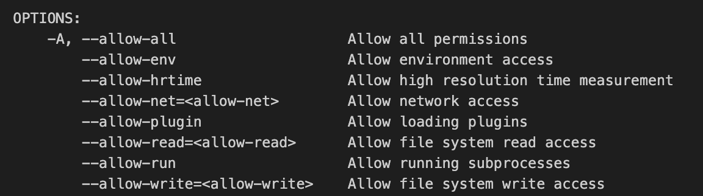

# DENO
Deno is a **JavaScript** and **TypeScript runtime** using **V8** and build in **Rust**.
* written in **Rust** ( program language written **by Mozilla** )
* has first class TypeScript support ( **by Microsoft** )
* uses **V8** engine by **Google** written in C++ ( same as Node, technology that browser use to  write JS straight into the browser's console ).


## Installation & plugin dedicated
* Mac/Linux : ```curl -fsSL https://deno.land/x/install/install.sh | sh```
* Windows : ```iwr https://deno.land/x/install/install.ps1 -useb | iex```
* .bash_profile : add export PATH to adjust related to built executable from deno while doing  
 ```deno install``` command within.

* Deno Plugin: https://marketplace.visualstudio.com/items?itemName=denoland.vscode-deno


## Quick Commands Reviews
| Commands | Meanings	|
|-|-|
| ```deno upgrade``` | Upgrade Deno version |
| ```deno run <file.ext>``` | To execute / run a file with Deno |
| ```deno run <file.ext> <string-arguments>``` | To execute / run a file with Deno w/ arguments |
| ```deno install <optional-renamed-project> <permissions> <file.ext>``` | To build an executable out of your file. |
| ```deno cache --lock=lock.json --lock <file-with-deps.ext>``` | Caches and lock the dependencies version into a lock.json file |


## Security & Permissions

